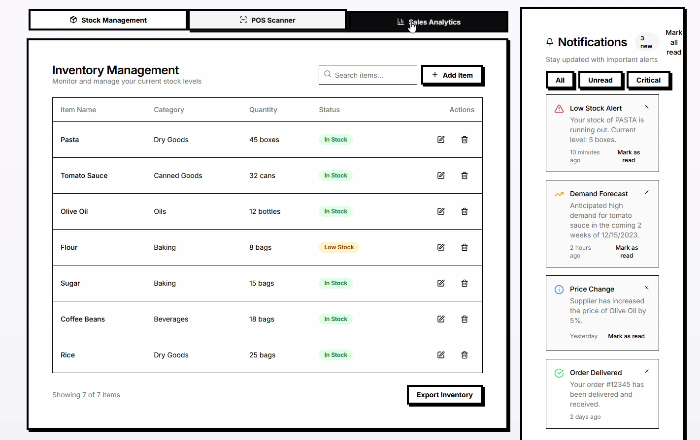
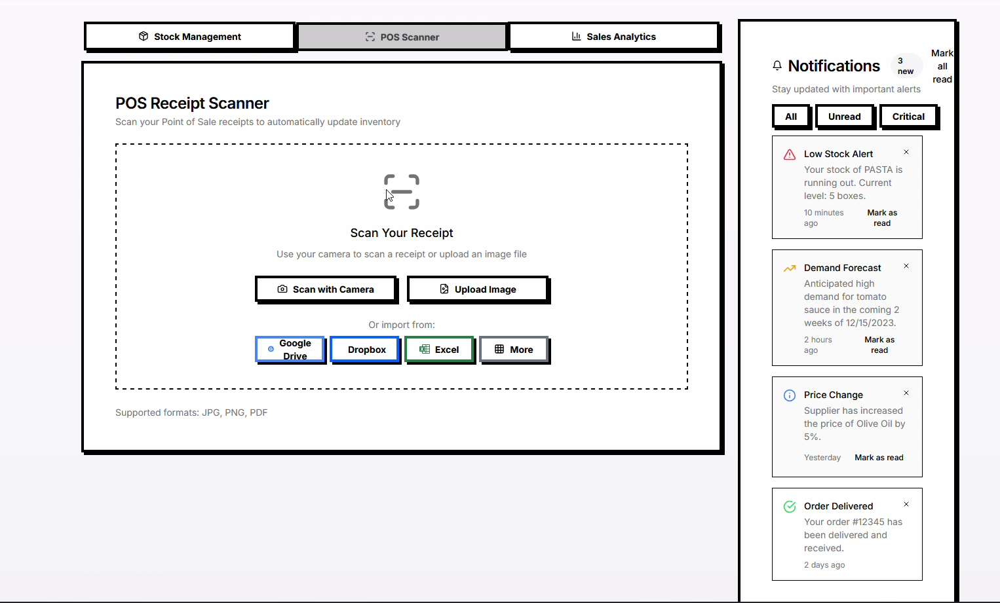
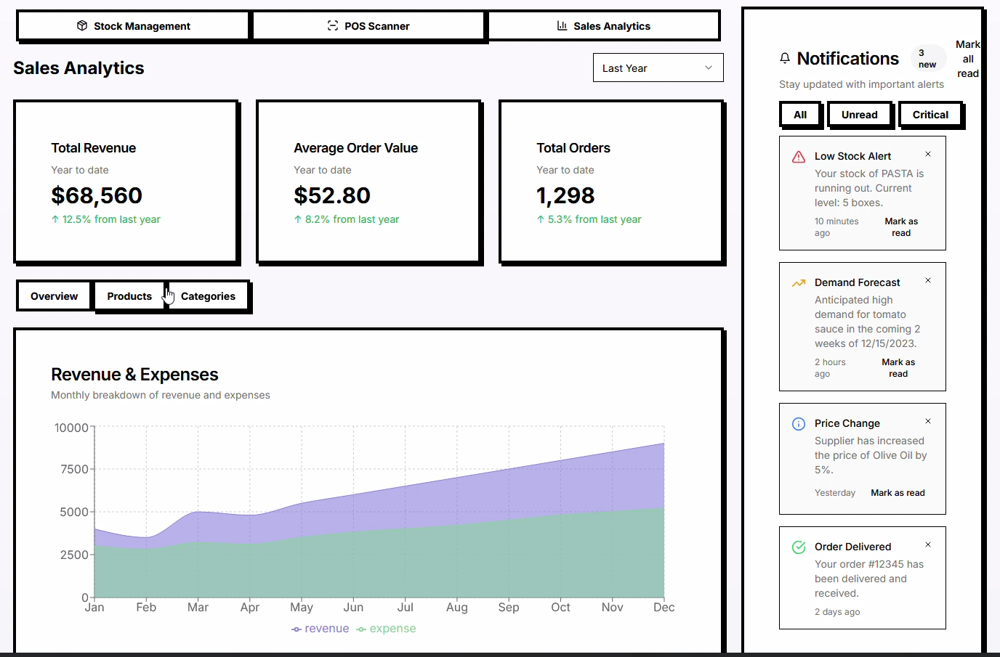
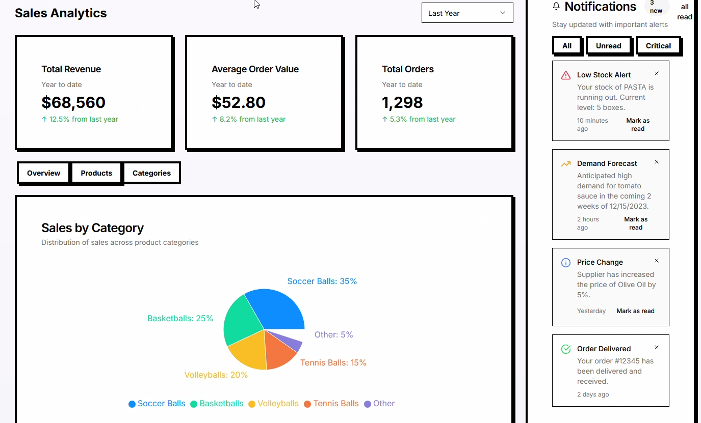

# AI-Powered Checkout/POS Frontend

## Stack

* Next.js
* React Native

## Usage

### Web

```console
$ cd yipee
$ npm run dev
```

View the site at [http://localhost:3000](http://localhost:3000).

### Mobile application

```console
$ cd yipee-native
$ npx expo install firebase @react-navigation/native @react-navigation/stack expo-constants react-native-gesture-handler react-native-safe-area-context react-native-screens expo-camera react-native-svg expo-image-picker
$ npm install react-native-chart-kit @react-navigation/bottom-tabs
```

* `npx expo start --clear -c --tunnel` for generic mobile build *(IOS deprecated, use the below)*
    * `npx expo run:android` for Android build
    * `npx expo run:ios` for IOS build
* `npx expo start --clear -c --tunnel --web` for web debugger

Scan the QR code with the [Camera](https://docs.expo.dev/versions/latest/sdk/camera/) app on IOS or the [Expo Go](https://play.google.com/store/apps/details?id=host.exp.exponent&hl=en_SG) app on Android.

## Screenshots

<div style="display: flex; justify-content: space-between;">
  
  
</div>
<br>
<div style="display: flex; justify-content: space-between;">
  
  
</div>