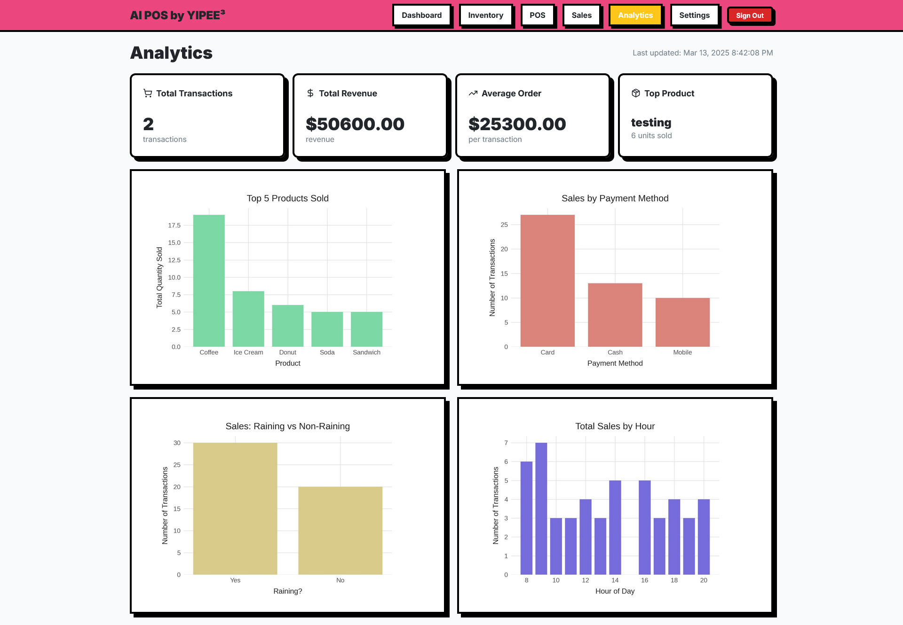

# AI-Powered Checkout/POS Frontend

## Stack

* React, Next.js, Vercel
* React Native, Expo *(mobile application now deprecated)*

## Screenshots

<div style="display: flex; justify-content: space-between;">
  
  
</div>
<br>
<div style="display: flex; justify-content: space-between;">
  
  
</div>
<br>
<div style="display: flex; justify-content: space-between;">
  
  
</div>
<br>
<div style="display: flex; justify-content: space-between;">
  
  
</div>

## Architecture

### Overview
  


### DB 

Firebase *(real-time database)* follows the below schema.

```txt
/users/
  /$userId/
    /metadata/
      createdAt: timestamp
      lastLogin: timestamp
      settings/
        businessName: string
        currency: string
        taxRate: number
        address: string
        phone: string
        email: string
        receiptFooter: string
    
    /inventory/
      /$itemId/
        id: string
        name: string
        price: number
        quantity: number
        category: string
        sku: string
        createdAt: timestamp
        updatedAt: timestamp
    
    /sales/
      /$saleId/
        id: string
        items: [
          {
            itemId: string
            name: string
            price: number
            quantity: number
          }
        ]
        total: number
        paymentMethod: string
        createdAt: timestamp

    /analytics/ 
        images: {
           image1: string,
           image2: string,
           ...
         }
```


## Local usage

For debugging purposes.

### Web application

Add Firebase secrets within a `.env.local`.

```env
NEXT_PUBLIC_FIREBASE_API_KEY=???
NEXT_PUBLIC_FIREBASE_AUTH_DOMAIN=???
NEXT_PUBLIC_FIREBASE_DATABASE_URL=???
NEXT_PUBLIC_FIREBASE_PROJECT_ID=???
NEXT_PUBLIC_FIREBASE_STORAGE_BUCKET=???
NEXT_PUBLIC_FIREBASE_MESSAGING_SENDER_ID=???
NEXT_PUBLIC_FIREBASE_APP_ID=???
NEXT_PUBLIC_FIREBASE_MEASUREMENT_ID=???
```

Then run the below.

```console
$ cd reworked-yipee/yipee-org
$ npm install firebase date-fns recharts lucide-react
$ npm run dev
```

View the site at [http://localhost:3000](http://localhost:3000).